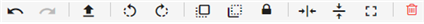
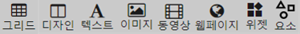

# 새 프레젠테이션 생성하기

## 새 프레젠테이션 생성하기

먼저 프레젠테이션 페이지에 새 프레젠테이션 생성을 합니다.

프레젠테이션 생성 시 정보입력

'새 프레젠테이션'을 클릭하여 나오는 새 창에서 가장 먼저 나오는 화면입니다. 프레젠테이션의 사이즈를 설정 할 수 있습니다.

* 이름 : 생성한 프레젠테이션의 이름을 4~128자 이내로 필수로 입력합니다.
* 설명 : 생성한 프레젠테이션의 설명을 4~128자 이내로 필수로 입력합니다.
* 모바일용 프레젠테이션 : 생성할 프레젠테이션을 모바일용으로 만듭니다. 체크 시 레이아웃 편집기의 일부 이용이 제한됩니다.
* 비율 : 16:9, 9:16, 4:3, 3:4, 1:1, x:x\(사용자 임의\) 여섯가지로 분류되며 사용자 지정 이외의 나머지 비율을 선택할 경우, 가로와 세로의 크기를 자동으로 조정해 줍니다.
* 가로 : 프레젠테이션의 가로 크기를 의미하며 px\(픽셀\)단위로 입력합니다.
* 세로 : 프레젠테이션의 세로 크기를 의미하며 px\(픽셀\)단위로 입력합니다.

레이아웃 편집기

 프레젠테이션을 만들기 위한 큐브릭클라우드사인만의 편집툴입니다. 레이아웃 편집기를 사용하여 본인이 원하는 디자인의 프레젠테이션을 만들 수 있습니다.

**격자**  

격자는 레이아웃 편집기 페이지에서 좌측 하단 '격자'아이콘을 클릭하여 사용합니다. 설정하는 간격으로 프레젠테이션에 격자를 넣을 수 있습니다.

설정간격

* 25x25
* 50x50
* 75x75

**확대 및 축소**  

돋보기 모양 우측의 초록색 원을 좌우로 움직여 프레젠테이션을 확대 및 축소할 수 있습니다. 숫자를 클릭하시면 원하는 크기를 입력할 수 있습니다. 또는 위아래 아이콘을 눌러 0.01 단위로 크기 변경이 가능합니다.

**배경 설정**  

우측 하단의 '배경 이미지'아이콘을 클릭하고, 단색 또는 갤러리에서 배경을 설정합니다.

* 색상 : 색상코드를 클릭하여 색을 선택하거나 직접 코드를 입력하여 변경할 수 있습니다.
* 갤러리 : 큐브릭클라우드사인에 업로드되어있는 이미지를 이용해 배경 설정이 가능합니다.

색상 혹은 갤러리에서 선택한 후 '삽입'을 클릭하면 배경이 적용됩니다.

**배경 음악 설정**  

1. 우측 하단의 '배경 음악'아이콘을 클릭합니다.
2. '배경 음악 사용'을 클릭하면 오디오 파일을 추가할 수 있으며, '반복'을 클릭하여 반복 재생이 가능합니다.
3. '배경 음악 사용' 을 클릭한 후 '배경 음악 추가'를 클릭해 갤러리에 있는 음악 파일을 선택할 수 있습니다. 음악 파일을 선택한 후 '삽입'을 클릭합니다.
4. 배경 음악이 추가된 것을 확인하고 '저장'을 누르면 배경 음악이 적용됩니다.

**새 프레젠테이션**  

1. 우측 상단의 '새 프레젠테이션'을 클릭합니다.
2. '새 프레젠테이션'을 클릭하면 캔버스 사이즈가 나오며 비율 및 가로, 세로를 설정한 후 '생성'을 클릭하면 새로운 프레젠테이션이 생성됩니다.

**다른이름으로 다운로드하기**  

우측 상단의 '다른 이름으로 다운로드하기'아이콘을 클릭하여 만든 프레젠테이션을 PDF나 JPG로 다운로드를 할 수 있습니다.

**기기로 보내기**  

사용자 계정에 등록된 플레이어 기기로 프레젠테이션을 전송할 수 있습니다.

1. 우측 상단의 '기기로 보내기'를 클릭합니다.
2. 기기를 선택하고 전송을 클릭하면 해당 플레이어 기기에서 프레젠테이션이 재생됩니다. \(다중 선택 가능\)


프레젠테이션 전송에 실패하였다면 프레젠테이션 전송창에서 '새로고침' 버튼을 눌러 플레이어 기기의 실시간 상태가 'ONLINE'인지 확인해주시길 바랍니다.


**프레젠테이션 미리보기**  

만든 프레젠테이션을 미리 볼 수 있습니다. 전체화면을 종료하고 싶은 경우 ESC를 누릅니다.

**저장**  

만든 프레젠테이션을 저장합니다.

**다른 이름으로 저장**  ****

만든 프레젠테이션을 다른 이름으로 저장할 수 있습니다.

1. '다른 이름으로 저장'아이콘을 클릭합니다.
2. 변경할 프레젠테이션 이름 \(4~128자\) 및 프레젠테이션 설명 \(4~128자\)을 입력하고 '저장'을 클릭하면 저장이 완료됩니다.

#### 기능

도구 공통 기능

* 되돌리기 : 현재 작업 전의 상태로 돌아갑니다.
* 되돌리기 취소 : 되돌리기 된 작업을 취소하고 원래 작업으로 돌아갑니다.
* 자료 업로드 : 레이아웃 편집기 안에서 자료를 업로드할 수 있습니다.
* 왼쪽으로 회전 : 왼쪽으로 90도 회전시킵니다.
* 오른쪽으로 회전 : 오른쪽으로 90도 회전시킵니다.
* 앞으로 보내기 : 해당 콘텐츠를 다른 콘텐츠 앞으로 보냅니다.
* 뒤로 보내기 : 해당 콘텐츠를 다른 콘텐츠 뒤로 보냅니다.
* 잠금 : 콘텐츠를 잠궈 이동 및 수정이 불가능한 상태로 만듭니다.
  * 삭제, 앞으로 보내기, 뒤로보내기, 이벤트는 편집이 가능합니다.
* 잠금 해제 : 콘텐츠의 잠금을 해제시켜 이동 및 수정이 가능한 상태로 만듭니다.
  * 잠금을 하였을 경우 잠금 아이콘이 잠금해제 아이콘으로 변환됩니다.
* 수평 중심 : 콘텐츠를 프레젠테이션의 수평 중심으로 이동시킵니다.
* 수직 중심 : 콘텐츠를 프레젠테이션의 수직 중심으로 이동시킵니다.
* 전체 화면 : 콘텐츠를 프레젠테이션의 크기에 맞게 늘립니다.
  * 비디오, 이미지, 웹페이지, 위젯만 제공합니다.
* 삭제 : 해당 콘텐츠를 삭제합니다.

#### 레이아웃 편집기 메뉴

레이아웃 편집기에서는 프레젠테이션 내부의 그리드, 디자인, 텍스트, 이미지, 동영상, 웹페이지, 위젯, 요소 콘텐츠를 이용 할 수 있으며,  사용자에게 다양하고 간편한 도구를 제공합니다.

**그리드**

* 그리드 : 양식이 미리 지정되어 있는 템플릿이며, 넣고 싶은 이미지나 비디오를 해당 칸 안에 드래그&드롭하면, 해당 칸이 맞는 이미지나 비디오로 변경됩니다.

**디자인**

사용할 템플릿을 선택한  좌측 하단의 '삽입'을 누르면 템플릿을 적용할 수 있습니다.

* 프레젠테이션 : 큐브릭클라우드사인에서 제공하는 템플릿입니다. 템플릿을 그대로 사용하거나 프레젠테이션의 도구를 이용해 수정하여 사용할 수 있습니다.

**텍스트**

텍스트를 입력하고 글씨체 및 글씨 크기를 지정한 후 아래 예시를 프레젠테이션에 드래그&드롭하여 적용할 수 있습니다.

* 폰트 : 텍스트의 글씨체를 설정할 수 있습니다.
* 텍스트 크기 : 텍스트의 크기를 설정할 수 있습니다.
* 볼드체, 이탤릭체, 밑줄, 취소선 : 텍스트의 스타일을 변경할 수 있으며 각각 굴게, 기울임, 밑줄, 취소선을 적용시킬 수 있습니다.
* 텍스트 색상 : 텍스트의 색을 변경할 수 있습니다.
* 텍스트 정렬 : 텍스트를 정렬할 수 있으며, 왼쪽, 가운데, 오른쪽, 양쪽 맞춤이 가능합니다.
* 텍스트 효과 : 텍스트의 이벤트를 설정합니다. 레인보우, 깜빡임, 가로 스크롤, 세로 스크롤이 있습니다.
* 텍스트 효과 속도 : 텍스트 효과의 속도를 설정합니다. 숫자가 높을수록 빨라집니다.
* 클릭 이벤트 : 해당 텍스트를 클릭하면 넘어갈 프레젠테이션을 설정합니다.

**이미지**

사용할 이미지를 선택해 프레젠테-이션에 드래그&드롭하여 적용할 수 있습니다.

* 갤러리 : 갤러리는 큐브릭클라우드사인에서 제공해주는 이미지입니다.
* 개인 갤러리 : 개인 갤러리는 사용자가 직접 큐브릭클라우드사인에 업로드한 이미지입니다.
* 구글 : 구글 게정을 연동한 경우 사용할 수 있으며, 구글 드라이브에 있는 이미지를 사용할 수 있습니다.

**동영상**

사용할 비디오를 선택해 프레젠테이션에 드래그&드롭하여 적용할 수 있습니다.

* 갤러리 : 개인 갤러리는 사용자가 직접 큐브릭클라우드사인에 업로드한 비디오입니다.
* 유튜브 : 유튜브에서 원하는 영상을 검색해 사용할 수 있습니다.
* 구글 : 구글 계정을 연동한 경우 사용할 수 있으며, 구글 드라이브에 있는 동영상을 사용할 수 있습니다.

**웹페이지**

웹을 기반으로 동작하는 도구입니다. 프레젠테이션에 웹페이지를 띄우거나, 데이터 설정 탭을 이용하여 어플리케션을 동작 할 수 있으며, 구글 프레젠테이션을 이용할 수 있습니다.

* 웹페이지 : 프레젠테이션에 띄우고 싶은 웹페이지의 주소\(URL\)를 기입한 후 하단의 '삽입'을 클릭하여 적용합니다.
  * 예\) www.cublick.com
* 구글 드라이브 : 구글 계정을 연동한 경우 사용할 수 있으며, 구글 드라이브에 있는 슬라이드 및 파워포인트 파일을 사용할 수 있습니다. 사용방법은 다른 도구와 같이 프레젠테이션 위에 드래그&드롭하여 적용할 수 있습니다.

**위젯**

사용할 위젯을 선택해 프레젠테이션에 드래그&드롭하여 적용할 수 있습니다. 위젯 탭에서 새로운 위젯 추가가 가능하며, 위젯을 프레젠테이션에 드래그&드롭하면 좌측 상단의 편집 기능도 사용하실 수 잇습니다.

**요소**

기본 도형이나 일러스트, 이미지 프레임을 이용할 수 있습니다.

* 도형 : 디자인에 도움을 줄 수 있는 기본 도형이 있으며, 프레젠테이션에 드래그&드롭하여 적용할 수 있습니다.
  * 클릭 이벤트 : 해당 도형을 클릭하면 넘어갈 프레젠테이션을 설정합니다.
* 일러스트 : 디자인에 도움을 줄 수 잇는 일러스트가 있으며, 프레젠테이션에 드래그&드롭하여 적용할 수 있습니다.
  * 클릭 이벤트 : 해당 도형을 클릭하면 넘어갈 프레젠테이션을 설정합니다.
* 이미지 프레임 : 디자인에 도움을 줄 수 있는 이미지 프레임이 있으며, 프레젠테이션에 드래그&드롭하여 적용할 수 있습니다. 그 위에 이미지를 드래그&드롭하면 프레임에 맞게 이미지가 들어갑니다.

